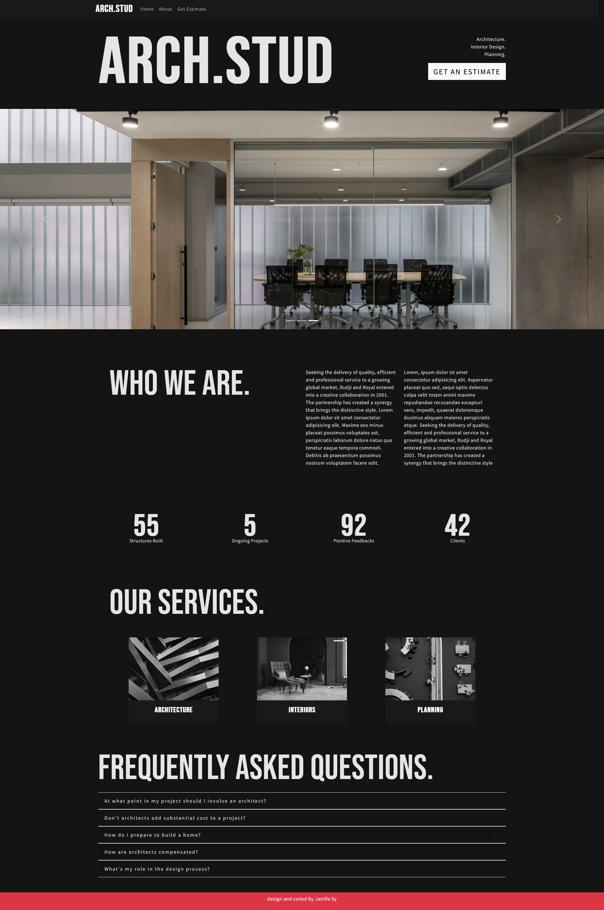
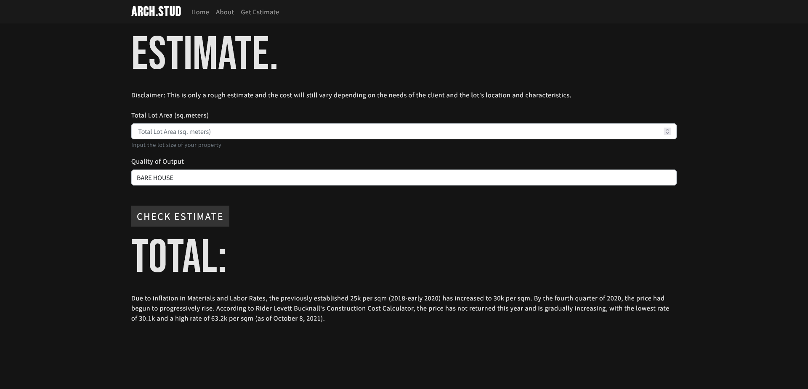
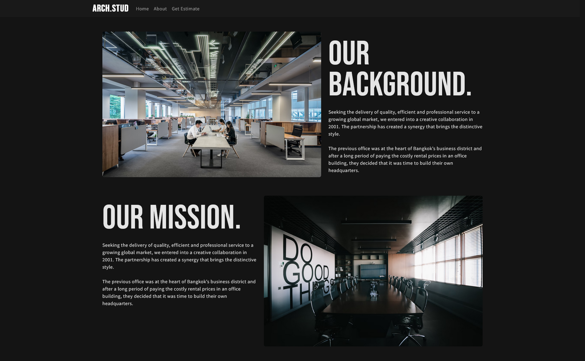
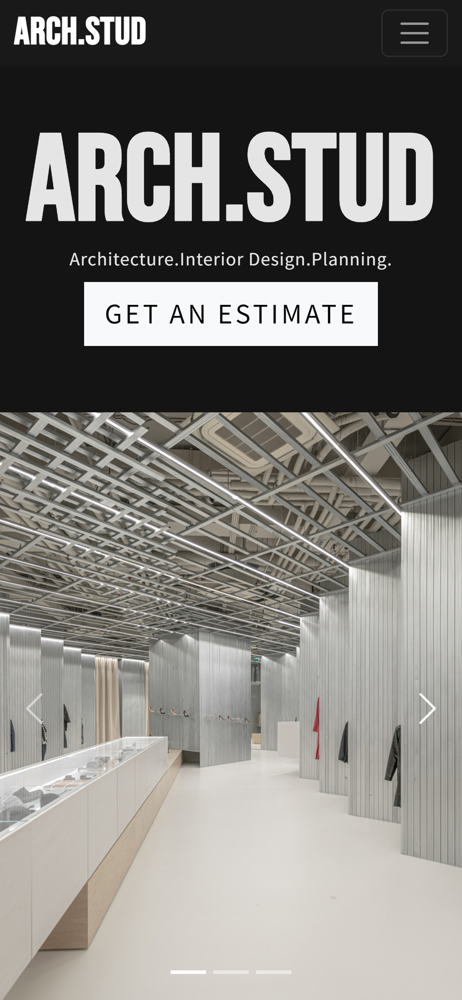

# Arch.Studio

> This is an unguided website created using React and employs simple TypeScript and Bootstrap features to enhance the user experience.
>
> Live demo [_here_](https://archstud.netlify.app/).

## Table of Contents

- [Arch.Studio](#archstudio)
  - [Table of Contents](#table-of-contents)
  - [General Information](#general-information)
  - [Technologies Used](#technologies-used)
  - [Features](#features)
  - [Screenshots](#screenshots)
  - [Contact](#contact)

## General Information

This landing website is created using React and employs simple TypeScript features to enhance the user experience. The homepage features an eye-catching hero section that draws the user's attention and encourages them to continue exploring the site. The navigation menu is user-friendly and easily accessible, allowing the user to browse through different sections of the site seamlessly. The landing website also utilizes simple TypeScript features to add interactive elements to the site, such as form validation and dynamic content rendering. With a clean and modern design, this landing website provides an excellent introduction to its business or service while ensuring a smooth and enjoyable user experience.

## Technologies Used

- React
- Typescript
- Bootstrap
- React-Bootstrap
- CSS
- HTML

## Features

- Responsive website layout across multiple devices
- Page and component animations
- House estimate calculator.

## Screenshots

## Contact

> Created by Janille Sy - feel free to contact me!
>
> EMAIL - syjanille@gmail.com
>
> MOBILE - 09268524297
